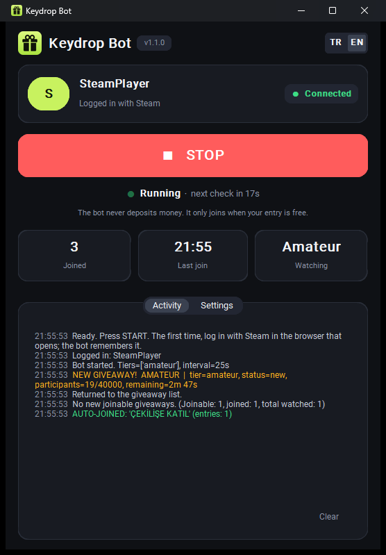

# Keydrop Bot — Free Keydrop Giveaways Bot & Auto Joiner

> **Keydrop Bot** is a lightweight **Keydrop giveaways bot** that watches [Keydrop](https://key-drop.com) giveaways and **auto-joins them for you** whenever your entry is free. A simple, safe, open-source **giveaways bot** with a modern one-button app, so you never miss a Keydrop giveaway again. **It never deposits money.**

  <strong>keydrop bot</strong> · <strong>keydrop giveaways bot</strong> · <strong>keydrop auto join</strong> · <strong>giveaways bot</strong> · <strong>keydrop giveaway joiner</strong> · <strong>keydrop free skins bot</strong>

  

  <em>☕ This bot is free and open source. If it won you some skins, buy me a coffee — it really keeps the project alive!</em>

  

---

## 🎁 What is Keydrop Bot?

**Keydrop Bot** is a free, open-source **giveaways bot for Keydrop**. It watches the Keydrop giveaways page in the background and, the moment a new giveaway starts, it:

- 🔍 **Detects new Keydrop giveaways** automatically (no manual refreshing)
- ✅ **Checks with Keydrop that you're eligible**, so joining is free for you
- 🖱️ **Auto-joins** by clicking "Join giveaway" for you, then **confirms the entry really counted**
- 🔒 **Never deposits money** and never clicks deposit or "extra entry" buttons
- 🔁 **Keeps monitoring 24/7** and returns to the list to keep watching

If you've been searching for a **Keydrop bot**, a **Keydrop giveaways bot**, a **Keydrop auto joiner**, or just a reliable **giveaways bot** to grab Keydrop giveaways while you're away from the keyboard, this is it.

---

## ✨ Features

| Feature | Description |
|--------|-------------|
| **One-click setup** | Double-click `KeydropBot.bat`. No Python, no commands, it installs everything itself |
| **Modern one-button app** | Big START / STOP button, account card, live status with countdown, session stats |
| **Keydrop giveaways auto join** | Joins every giveaway you're eligible for and verifies the entry with Keydrop |
| **Deposit safety** | Never deposits, never clicks deposit / extra-entry buttons; tells you if a deposit is missing |
| **Automatic login detection** | Log in with Steam once; the bot notices by itself and remembers your session |
| **Multiple giveaway tiers** | Amateur by default; Contender, Challenger and Champion optional |
| **Auto-update** | Shows a banner when a new version is out; one click updates it |
| **English & Turkish** | Follows your Windows language; switch any time (TR / EN) |

---

## 🚀 Quick Start

### 1. Download

Go to **[Releases](https://github.com/Asilturkmen/keydrop-giveawaysBOT/releases/latest)**, download the **Source code (zip)** and **extract it** (right click → *Extract All*).

### 2. Double-click `KeydropBot.bat`

The first time, it downloads everything the bot needs (about 250 MB, a few minutes) and adds a **Keydrop Bot** shortcut to your desktop. After that it opens in a second.

> If Windows shows a blue **"Windows protected your PC"** box, click **More info → Run anyway**. The bot is open source; you can read every line in `src/`.

### 3. Press **START**

A browser window opens on Keydrop. **The first time, log in with your Steam account in that window.** The bot detects the login by itself and starts. It remembers your session, so next time just press START.

That's it. Keep the bot's browser window open (you can minimize it). Press **STOP** any time.

---

## 🎟️ How Keydrop giveaways work (and when joining is free)

Keydrop only lets you join a giveaway if you deposited a **minimum amount within a time window** that depends on your **account level**:

| Your level | Deposit must be within the last |
|------------|------------------------------|
| below 10 | 24 hours |
| 10+ | 2 days |
| 15+ | 5 days |
| 30+ | 10 days |
| 50+ | 14 days |

The minimum is set per giveaway (Amateur: 2 USD at the time of writing; higher tiers ask more). **If you meet it, joining is free and the bot joins for you.** If you don't, the bot skips the giveaway and tells you how much is missing, for example:

> *Not eligible: Keydrop requires a 2 USD deposit within your level's time window (2 USD missing). The bot never deposits money; skipped.*

Keydrop enters you automatically only once, right after your first deposit. After that you have to press "Join giveaway" for every new giveaway, and that's the part the bot does for you.

---

## ⚙️ Settings

Open the **Settings** tab in the app. Your choices are remembered.

- **Check interval**: how often the bot checks Keydrop (default 25 s).
- **Giveaway tiers**: Amateur by default; add Contender, Challenger, Champion.
- **Auto-join**: join automatically when you're eligible (on by default).
- **Open the giveaway page**: open a new giveaway's page even when not auto-joining.
- **DEBUG**: write `debug_payloads.json` for troubleshooting.

---

## 🛠️ Troubleshooting

- **"Not eligible … missing"**: Keydrop wants a recent deposit (see the table above). The bot never deposits for you.
- **"Your Keydrop session ended"**: log in again with Steam in the bot's browser window; the bot continues by itself.
- **"List didn't load" / "No records captured"**: turn on **DEBUG**, run the bot once and send the `debug_payloads.json` file from the bot's folder with your issue. It contains your Steam ID and username, so share it privately or remove them first.
- **Setup failed**: check your internet connection and run `KeydropBot.bat` again; it continues where it stopped.

---

## 🔄 Updating

When a new version is released, the app shows a **"New version available"** banner. Stop the bot and click **Update**; it updates and restarts by itself.

**Coming from v1.0.x?** Download the new ZIP once. To keep your Keydrop login, copy the old `keydrop_profile` folder into the new folder.

---

## 📁 Folder Contents

- **`KeydropBot.bat`**: the only file you need to click
- **`src/`**: the bot's code (`keydrop_ui.py`), its package list and icon
- **`README.md`**: this guide

Created while running (personal, **never pushed to GitHub**): `keydrop_profile/` (your browser session), `settings.json`, `debug_payloads.json`, `.tools/`.

**Uninstall:** delete the folder and the desktop shortcut. The shared Python and browser downloads live in `%LOCALAPPDATA%\uv` and `%LOCALAPPDATA%\ms-playwright`; delete those too if nothing else uses them.

---

## 🔒 Security & Privacy

Your **Steam session data is never sent anywhere**. This **Keydrop bot** only uses the browser session you opened yourself, on your own machine. It **never deposits money** and never clicks deposit or extra-entry buttons. It's open source: read the code in `src/` and see exactly what it does.

---

## 🧰 Requirements

- **Windows 10 (version 1803 or newer) or Windows 11**
- An internet connection
- A **Steam account** to log in to Keydrop

Python is **not** required; `KeydropBot.bat` downloads everything (via [uv](https://github.com/astral-sh/uv) and [Playwright](https://playwright.dev)).

**Developers:** `pip install -r src/requirements.txt`, `python -m playwright install chromium`, then `python src/keydrop_ui.py`.

---

## ❓ FAQ

**Is this a free Keydrop bot?**
Yes. Keydrop Bot is 100% free and open source.

**Does the Keydrop giveaways bot spend or deposit money?**
Never. It only joins when Keydrop says your entry is free (you already meet the deposit requirement). Otherwise it tells you what's missing and skips.

**Do I need Python?**
No. Just double-click `KeydropBot.bat`.

**Is the Keydrop auto join bot safe?**
It never sends your Steam credentials anywhere; it only uses your own local browser session.

**Can it run 24/7 as a giveaways bot?**
Yes. Leave it running and it keeps monitoring Keydrop and joining new giveaways.

---

## 🏷️ Keywords

`keydrop bot` · `keydrop giveaways bot` · `keydrop giveaway bot` · `giveaways bot` · `keydrop auto join` · `keydrop auto joiner` · `keydrop giveaway joiner` · `keydrop free giveaways` · `keydrop free skins bot` · `keydrop automation` · `keydrop monitor` · `key-drop bot` · `csgo skins giveaway bot` · `steam giveaway bot`

---

## 📜 Disclaimer

This is an unofficial, community-made tool and is **not affiliated with Keydrop / key-drop.com**. Use it responsibly and at your own discretion, in line with Keydrop's terms of service.

---

## ☕ Support This Project

This **Keydrop giveaways bot** is built and maintained in my free time, and it's **completely free** for everyone. If it helped you snag some Keydrop giveaways, the best way to say thanks is to **buy me a coffee**. Every coffee directly motivates me to keep improving the bot, fix issues faster, and add new features. Your support truly means a lot. ❤️

  

  👉 <a href="https://buymeacoffee.com/turkmenasil"><strong>buymeacoffee.com/turkmenasil</strong></a>

---

> ⭐ If this **Keydrop giveaways bot** helped you grab giveaways, consider **starring the repo** and **buying me a coffee** above. It helps others find the bot and keeps development going!
